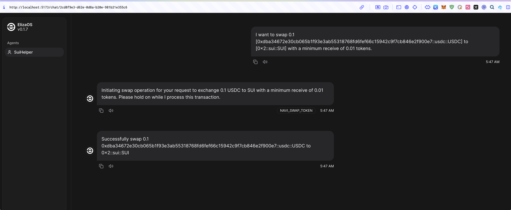

# Eliza-NAVI-trading 🤖

This project is forked from [Eliza](https://github.com/elizaOS/eliza) v0.1.8, with future contributions planned to be made to Elizaos through [FWangZil/Eliza](https://github.com/FWangZil/eliza).

Current Status:

1. This project integrates the NAVI SDK into elizaOS's SUI Plugin, equipping AI Agents with the rich functionality supported by NAVI. In the current version, it's already possible to swap any tokens. Future updates will support other NAVI Protocol features, such as flash loans.

2. Support for Atoma Network's AI Provider has been added to elizaOS. Developers can now utilize Atoma's excellent AI services in appropriate scenarios to enhance the diverse Agent capabilities of elizaOS.

Future Plans:

1. Enhance NAVI Protocol transaction support, enabling AI Agents to perform complex transactions such as flash loans.
2. Improve Provider and data support, allowing AI Agents to autonomously select suitable trading pairs for:
    - Choosing trading pairs
    - Selecting transaction types
    - Determining transaction amounts
    - Automating arbitrage
3. Optimize edge case handling and enhance transaction security controls
4. Improve overall code quality

Display Video:
    Chinese voice, English subtitles: [Youtube](https://youtu.be/HdLETOCFV7c)
    English voice, English subtitles: [Youtube](https://youtu.be/ganjhxq4u9k)
Transaction in the video: <https://suivision.xyz/txblock/HVqnDDrK9Vu2x1i1sjAcTrAfydSv3wjBh4NXuMwwYL25>



## 🚀 Quick Start

### Prerequisites

- [Python 2.7+](https://www.python.org/downloads/)
- [Node.js 23+](https://docs.npmjs.com/downloading-and-installing-node-js-and-npm)
- [pnpm](https://pnpm.io/installation)

> **Note for Windows Users:** [WSL 2](https://learn.microsoft.com/en-us/windows/wsl/install-manual) is required.

### Use the Starter (Recommended)

```bash
git clone https://github.com/elizaos/eliza-starter.git
cd eliza-starter
cp .env.example .env
pnpm i && pnpm build && pnpm start
```

Once the agent is running, you should see the message to run "pnpm start:client" at the end.
Open another terminal and move to same directory and then run below command and follow the URL to chat to your agent.

```bash
pnpm start:client
```

Then read the [Documentation](https://elizaos.github.io/eliza/) to learn how to customize your Eliza.

### Manually Start Eliza (Only recommended if you know what you are doing)

```bash
# Clone the repository
git clone https://github.com/elizaos/eliza.git

# Checkout the latest release
# This project iterates fast, so we recommend checking out the latest release
git checkout $(git describe --tags --abbrev=0)
# If the above doesn't checkout the latest release, this should work:
# git checkout $(git describe --tags `git rev-list --tags --max-count=1`)
```

### Start Eliza with Gitpod

[](https://gitpod.io/#https://github.com/elizaos/eliza/tree/main)

### Edit the .env file

Copy .env.example to .env and fill in the appropriate values.

```
cp .env.example .env
```

Note: .env is optional. If you're planning to run multiple distinct agents, you can pass secrets through the character JSON

### Automatically Start Eliza

This will run everything to set up the project and start the bot with the default character.

```bash
sh scripts/start.sh
```

### Edit the character file

1. Open `packages/core/src/defaultCharacter.ts` to modify the default character. Uncomment and edit.

2. To load custom characters:
    - Use `pnpm start --characters="path/to/your/character.json"`
    - Multiple character files can be loaded simultaneously
3. Connect with X (Twitter)
    - change `"clients": []` to `"clients": ["twitter"]` in the character file to connect with X

### Manually Start Eliza

```bash
pnpm i
pnpm build
pnpm start

# The project iterates fast, sometimes you need to clean the project if you are coming back to the project
pnpm clean
```

#### Additional Requirements

You may need to install Sharp. If you see an error when starting up, try installing it with the following command:

```
pnpm install --include=optional sharp
```

### Community & contact

- [GitHub Issues](https://github.com/elizaos/eliza/issues). Best for: bugs you encounter using Eliza, and feature proposals.
- [Discord](https://discord.gg/ai16z). Best for: sharing your applications and hanging out with the community.

## Contributors

<a href="https://github.com/elizaos/eliza/graphs/contributors">
  
</a>

## Star History

[](https://star-history.com/#elizaos/eliza&Date)
